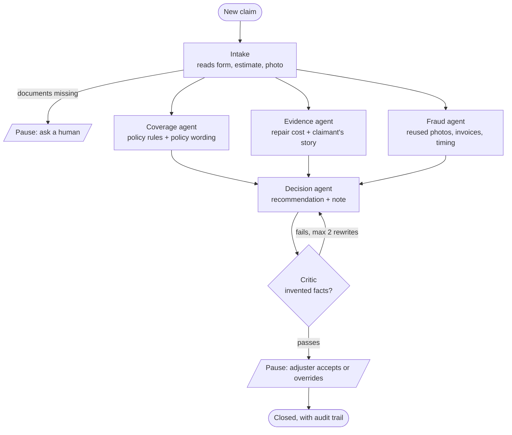

# Motor Insurance Claims Reviewer: multi-agent AI with a human in charge

A LangGraph system that reviews motor insurance claims the way an adjuster's team would.
It reads the claim form, repair estimate and damage photo, checks the policy wording, the
repair cost, and fraud signals, then **recommends** approve / investigate / deny with a
written note and quoted policy clauses. **A human adjuster always makes the final decision.**

Built as a learning project with LangChain + LangGraph, OpenAI models, and Streamlit.

<!-- Add a screenshot of the app: save it as docs/app.png and it will show here -->


---

## Results (honest version)

The system was tuned on 48 **dev** claims. It was then run **once** on claims nobody had
looked at, with the code frozen (a fingerprint of the code files is saved with each result,
so a changed system cannot reuse an old score).

| Test | Claims | Correct | Wrong approvals | Wrong denials |
|---|---|---|---|---|
| Test 1 (first system, before the fixes below) | 10 | 6 (60%) | 3 | 0 |
| Test 2 (final system) | 20 | 16 (80%) | 1 | 0 |
| Test 3 (final system, same code as test 2) | 20 | 19 (95%) | 1 | 0 |
| **Tests 2 + 3 combined** | **40** | **35 (88%)**, likely range 74–95% | **2** | **0** |

The dev score (44/48) is **not** the headline number: every change was chosen by looking at
those claims, so it is optimistic. Test 1 exposed real weaknesses; the fixes were decided and
recorded (`outputs/policy_decisions.jsonl`) before tests 2 and 3 were created.

**Where it still goes wrong:** every remaining mistake traces back to the photo reader
misjudging how severe the damage is (and so how much the repair should cost). Two inflated
bills were approved in 40 claims. That is why a human signs every decision.

---

## How it works



| Step | What does the work |
|---|---|
| **Intake** | AI (vision model) reads the claim form, estimate and photo into structured data; plain code checks dates, amounts and names match. |
| **Coverage** | Plain code checks the policy exists, is active and is comprehensive. Hybrid search (BM25 keywords + embeddings) finds the relevant clauses in the policy PDF; the AI judges them; **plain code verifies every quote word for word** against the PDF. |
| **Evidence** | Plain code compares the amount with the typical repair cost for the damage seen in the photo. The AI checks whether the claimant's description exaggerates the damage. |
| **Fraud** | Plain code only: photo fingerprints (perceptual hashes) against earlier claims, repeated invoice numbers, policies started days before the incident, late reports, repeat claimants. |
| **Decision** | Plain rules choose the recommendation; the AI only writes the note. |
| **Critic** | Plain code rejects notes with invented flags, unverified quotes, numbers not in the findings, or "nothing found" when something was found. |
| **Human review** | The graph pauses (`interrupt()`); the adjuster accepts or overrides, and must sign with a name. |

Coverage, evidence and fraud run **in parallel**; the decision waits for all three.
A SQLite checkpointer saves every claim, so a paused claim can be resumed days later, from
the terminal or the app.

**Design choice:** the AI reads, searches and writes; **rules decide**. Letting the AI
escalate claims on its own was tested and switched off: it held up honest claims without
catching more fraud.

---

## The app (Claims Review Desk)

`streamlit run app.py`

- **Review queue:** photo, recommendation, flags, verified policy quotes, and the full output
  of every agent. The adjuster accepts or overrides with a note.
- **Process a claim:** watch the agents work step by step.
- **Audit trail:** every step and every human decision, with who and when.
- **Results:** the held-out test results above, read from the saved files.

The app only offers dev claims (held-out test claims stay untouched) and never shows the
"correct answers".

---

## Run it

Requires Python 3.11+.

```bash
python -m venv .venv
.venv\Scripts\activate            # Windows  (macOS/Linux: source .venv/bin/activate)
pip install -r requirements.txt
```

Create a `.env` file (never commit it):

```
LLM_PROVIDER=openai
OPENAI_API_KEY=...
OPENAI_MODEL=gpt-5.4-nano          # text: coverage, story check, notes
OPENAI_VISION_MODEL=gpt-5.4-mini   # photos and documents
```

`LLM_PROVIDER=gemini` with `GOOGLE_API_KEY` also works.

Data (the photos and policy PDFs are not in the repo, see below):

```bash
python generate_claims.py          # synthetic claims from data/labels.csv + data/photos/
python policy_index.py build       # index the policy PDFs in data/policies/
python run_intake.py --dev         # AI reads the dev claims once (saved, never paid twice)
```

Use it:

```bash
streamlit run app.py                         # the adjuster app
python run_graph.py C002                     # one claim in the terminal, pauses for you
python run_graph.py C002 --resume accept     # ...then accept (or --resume deny --note "...")
python run_graph.py --dev                    # all 48 dev claims with a score (rules only, free)
python -m pytest tests -q                    # 119 tests, no API calls needed
```

AI answers are cached in `outputs/llm_cache.sqlite`, so re-running an experiment costs nothing.

---

## How it was evaluated (and kept honest)

- **Splits:** 48 dev claims for building; held-out sets `test` (10), `test2` (20) and
  `test3` (20). Scripts refuse to run tuning tools on test claims.
- **One run only:** `final_test.py` runs a held-out set once, saves the result with a
  fingerprint of the code, and refuses to run it again.
- **Frozen labels:** the photo labels for tests 2 and 3 were written and hashed
  (`data/labels_test2_freeze.json`) before any model saw those photos.
- **Rules written before results:** each change had its keep/reject rule written down
  first. A photo-prompt change was **rejected** because it failed its rule.
- **Nothing removed after the fact:** failed test claims were kept in the score.
- **Decision log:** `outputs/policy_decisions.jsonl` records every change, with evidence.
- **Regression gate:** `evaluate.py` runs in GitHub Actions and fails the build if a
  metric drops.

---

## Limits (please read)

- **Synthetic claims.** Claimants, forms, estimates and policy records are generated.
  The damage photos are real, but the claims around them are not.
- **Fictional prices.** The repair cost table (`data/repair_costs.csv`) is invented; for many claims
  (especially glass and lights) it is 2–4x above real Pakistani prices. A check against 2025 market
  prices is in `what_if_prices.py` (analysis only, it does not change the system).
  With real prices the cost check works the same way, but it would need to know the car's
  size class (small car / sedan / SUV).
- **Small test sets.** 40 held-out claims give a wide range (74–95%). This is a prototype,
  not a production-ready system.
- **Photo severity is the weak point.** Telling "moderate" from "severe" damage from one
  photo is where the remaining errors come from.
- **An assistant, not an auto-approver.** It is designed so a human signs every decision.

---

## Project layout

| File | Purpose |
|---|---|
| `claim_graph.py` | The LangGraph workflow (parallel agents, critic loop, human pause, checkpoints) |
| `intake.py` | Reads forms, estimates and photos into structured data |
| `coverage_agent.py`, `policy_index.py` | Policy rules, hybrid search over policy PDFs, verified quotes |
| `evidence_agent.py` | Repair cost check and the claimant's story check |
| `fraud_agent.py` | Photo fingerprints, invoices, timing, repeat claimants |
| `decision_agent.py` | Recommendation rules, AI note, critic |
| `llm.py` | Model setup (OpenAI / Gemini), caching, feature switches |
| `app.py`, `adjuster_service.py` | Streamlit app and the logic behind it |
| `final_test.py`, `evaluate.py`, `eval_photos.py` | Held-out tests, regression gate, photo benchmark |
| `generate_claims.py`, `generate_test2.py` | Synthetic claim generator |
| `what_if_prices.py` | Analysis: fictional vs real repair prices |

## Data sources


- **Policy wordings** (`data/policies/`, not included in the repo; download them from the insurers):
  - Jubilee General Insurance (Pakistan): [Private Car Comprehensive policy wording](https://jubileegeneral.com.pk/coverage/uploads/pdfs/help_center/policy_wording/policy-wording-private-car-comprehensive.pdf)
  - ICICI Lombard (India): [Private Car Package policy wording, UIN IRDAN115RP0017V01200102](https://www.icicilombard.com/docs/default-source/default-document-library/private-car-package-policy-wording.pdf)
  - Etiqa General Insurance Berhad (Malaysia): [Private Car policy wording](https://www.etiqa.com.my/pdfs/en/download-document/general-insurance/Policy+Wording+PRIVATE+CAR+Insurance.pdf)
- **Damage photos:** 100 real car damage photos from a public dataset, labelled by hand for this
  project (`data/labels.csv`). The photos are not included in the repo.

## Built with

LangChain, LangGraph (StateGraph, `interrupt`, SQLite checkpointer), OpenAI GPT-5.4 nano and mini,
Streamlit, BM25 + embeddings, pypdf, imagehash, pytest.
